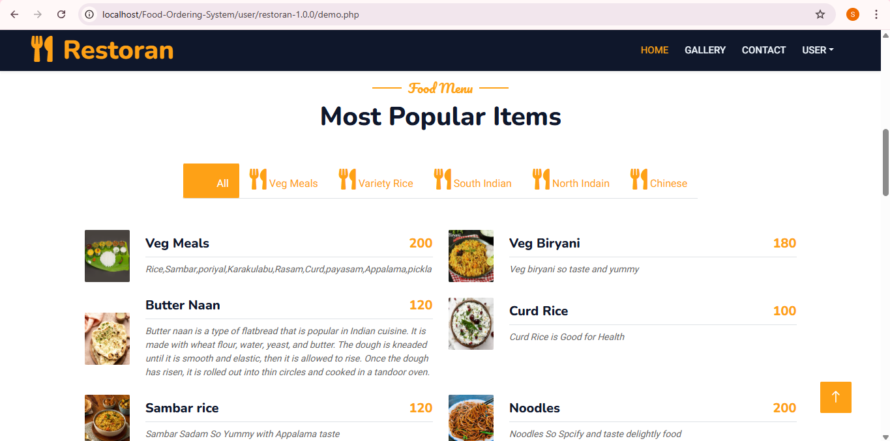
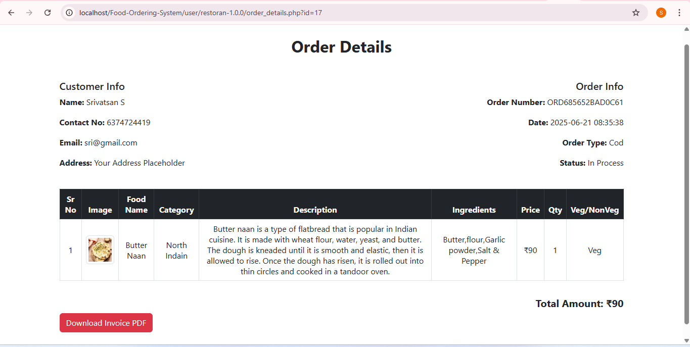
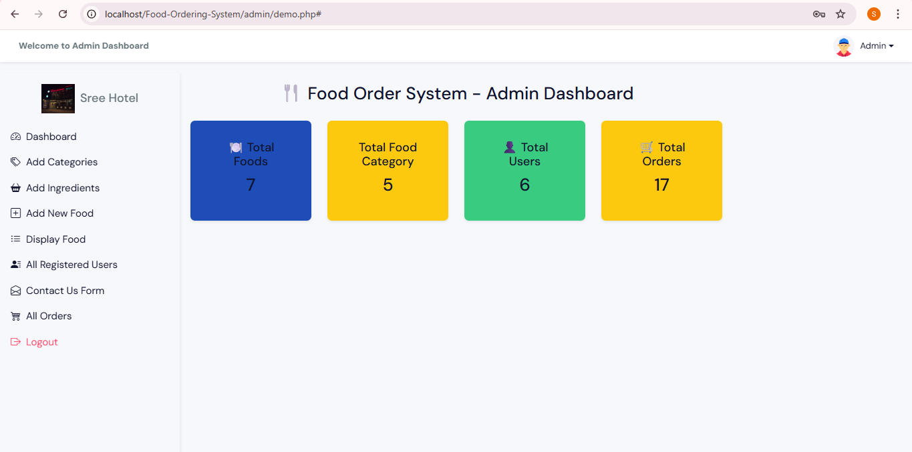
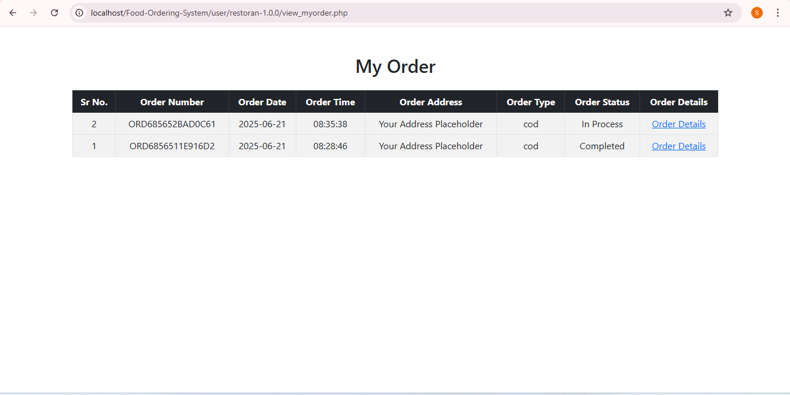

# 🍽️ Online Food Ordering System in PHP

This is a full-stack **Food Ordering System** developed using **PHP, MySQL, Bootstrap**, and **AJAX**. It allows users to browse food items, add them to the cart, place orders, and for admins to manage users, food listings, orders, and categories.

---

## 🚀 Features

### 👨‍🍳 User Side
- Browse food menu by category
- View food details
- Add to cart (with quantity update and remove)
- Checkout and place order
- View order success confirmation
- Contact Us form

### 🔐 Admin Panel
- Dashboard with statistics (Total Food, Users, Orders)
- Add / Edit / Delete Food Items
- Manage Categories and Ingredients
- View all registered users
- Manage Orders and change order status

---

## 🧑‍💻 Technologies Used
- PHP
- MySQL
- HTML5 & CSS3
- Bootstrap 5
- JavaScript / jQuery
- AJAX
- Font Awesome / Bootstrap Icons

---


## 📸 Screenshots

### 🔹 User Home Page


### 🔹 Add to Cart Page


### 🔹 Admin Dashboard


### 🔹 Home View


### 🔹 View Order Page



## 🛠️ Installation

### 1️⃣ Clone the Repository

```bash
git clone https://github.com/Srivatsan-Srinivasan-L/Online-Food-Ordering-System-in-PHP.git
cd  Online-Food-Ordering-System-in-PHP


